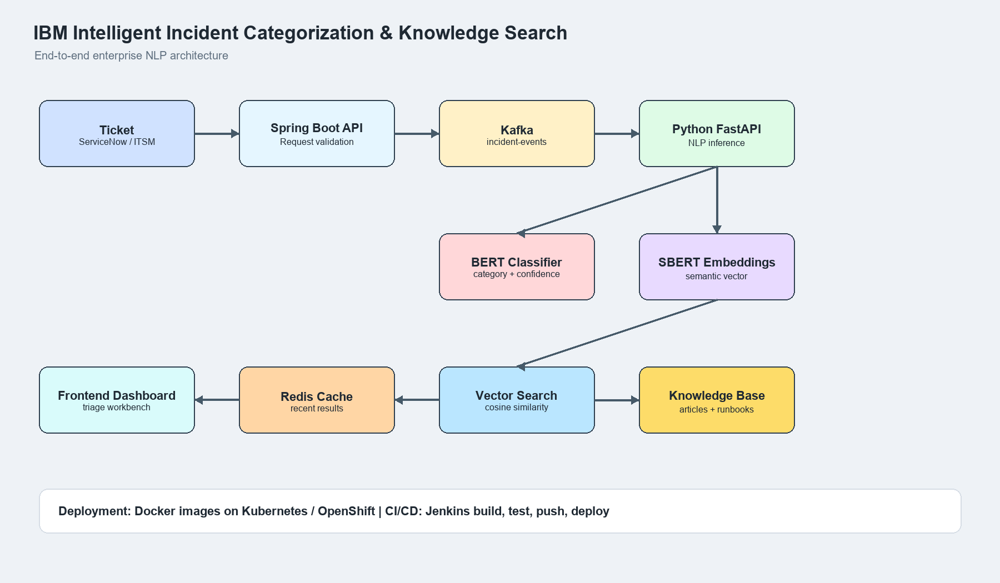

# IICKS  (Intelligent Incident Categorization & Knowledge Search) 
### _(Prototype of what I made for IBM in 2021-2022)_

An enterprise NLP platform designed to automate IT incident triage and knowledge discovery for large-scale support operations.\
A Spring Boot API gateway receives support tickets, forwards them to a Python ML inference service, and returns ticket classification, similar historical incidents, and recommended knowledge-base articles. The Python service also publishes Kafka workflow events and can cache repeated analysis responses in Redis to help support teams resolve incidents faster.

This repo is intentionally runnable without downloading external ML models. The default ML backend uses a local TF-IDF centroid classifier and cosine-similarity retrieval as an offline fallback. The codebase also includes the older production-grade interfaces for Spring Boot APIs, Kafka, Redis, preprocessing, vector search, Hugging Face BERT classification, and Sentence-BERT retrieval.
The platform follows a microservices-based architecture:

**Support Ticket → Spring Boot API → Python NLP Service → Classification & Similarity Search → Results**

```
CATEGORY_ID_PREFIX = {
    "Authentication": 1,
    "Network": 2,
    "Application": 3,
    "Endpoint": 4,
    "Database": 5
}
```
## Project Layout

```text
backend/
  app/
    main.py          Python ML inference API
    nlp_engine.py    local classification and semantic retrieval engine
    cache.py         Redis-backed analysis response cache
    events.py        Kafka event publisher
    worker.py        Kafka consumer worker for async analysis
    vector_store.py  in-memory vector similarity index
    preprocessing.py ticket text normalization
    schemas.py       request and response models
  data/
    incidents.csv    historical incident examples
    kb_articles.csv  knowledge article examples
  tests/
spring-api/
  pom.xml            Spring Boot 2.7 API gateway
  src/main/java/     Java API controllers, clients, DTOs
frontend/
  index.html
  styles.css
  app.js
scripts/
  generate_architecture_png.py
docs/
  architecture.png
```

## Implemented Architecture

```text
Ticket arrives
  |
  v
Spring Boot API gateway
  |
  v
Python ML inference service
  |
  +--> Redis cache lookup for repeated requests
  |
  +--> Kafka incident.analysis.requested event
  |
  v
Preprocessing
  |
  v
Classifier
  |
  +--> Default: local TF-IDF category centroid classifier
  +--> Optional adapter: Hugging Face BertForSequenceClassification
  |
  v
Vector similarity search
  |
  +--> Default: sparse TF-IDF cosine search
  +--> Optional adapter: Sentence-BERT dense embeddings
  |
  v
Top similar tickets + KB articles
  |
  +--> Redis cache write
  +--> Kafka incident.analysis.completed event
  |
  v
Frontend dashboard / API response
```

### Component Status

| Component | Status |
| --- | --- |
| Spring Boot API gateway | Implemented with Spring Boot 2.7 / Java 11 |
| Python ML inference service | Implemented with FastAPI |
| Frontend dashboard | Implemented |
| Kafka event publishing | Implemented through `kafka-python` |
| Kafka async worker | Implemented in `backend/app/worker.py` |
| Redis response cache | Implemented through `redis-py` |
| Preprocessing | Implemented in `backend/app/preprocessing.py` |
| Vector search | Implemented in `backend/app/vector_store.py` |
| Hugging Face BERT classifier adapter | Implemented as an optional adapter; requires trained model artifacts |
| Sentence-BERT adapter | Implemented as an optional adapter; requires model weights |
| Default local model | TF-IDF fallback, used when no BERT/SBERT artifacts are installed |

## Backend Workflow

The backend is split into two runtime layers:

1. Spring Boot acts as the API gateway for the dashboard and external callers.
2. Python FastAPI performs NLP inference, retrieval, caching, and Kafka event handling.

### Request Flow

#### 1. Ticket submission from the UI

The frontend in [frontend/app.js](./frontend/app.js) sends requests to the Spring Boot gateway at `http://127.0.0.1:8080`.

#### 2. Spring Boot controller receives the request

The entry point is [spring-api/src/main/java/com/ibm/incident/gateway/controller/IncidentController.java](./spring-api/src/main/java/com/ibm/incident/gateway/controller/IncidentController.java).

Method flow:

`IncidentController.analyze()` -> `NlpServiceClient.analyze()`

The controller exposes:

| Endpoint | Controller method | Next call |
| --- | --- | --- |
| `GET /health` | `IncidentController.health()` | `NlpServiceClient.health()` |
| `POST /api/analyze` | `IncidentController.analyze()` | `NlpServiceClient.analyze()` |
| `GET /api/examples` | `IncidentController.examples()` | `NlpServiceClient.examples()` |

#### 3. Spring Boot forwards to Python

The HTTP client lives in [spring-api/src/main/java/com/ibm/incident/gateway/client/NlpServiceClient.java](./spring-api/src/main/java/com/ibm/incident/gateway/client/NlpServiceClient.java).

It forwards the request to the Python service configured by `NLP_SERVICE_URL`, which defaults to `http://127.0.0.1:8000`.

#### 4. Python FastAPI receives the request

The FastAPI entry point is [backend/app/main.py](./backend/app/main.py).

Method flow:

`app.main.analyze_ticket()` -> `analysis_cache.get()` -> `event_publisher.publish_request()` -> `engine.analyze()` -> `analysis_cache.set()` -> `event_publisher.publish_result()`

Other endpoints:

| Endpoint | Function | Purpose |
| --- | --- | --- |
| `GET /health` | `health()` | Reports loaded data, cache status, Kafka status, and active model backend |
| `POST /api/analyze` | `analyze_ticket()` | Runs analysis and returns category, similar tickets, and KB articles |
| `POST /api/submit` | `submit_ticket()` | Publishes an async Kafka request without waiting for inference |
| `GET /api/examples` | `examples()` | Returns sample ticket text for the UI |

#### 5. Caching and Kafka hooks

The optional Redis cache is implemented in [backend/app/cache.py](./backend/app/cache.py).

Method flow:

`AnalysisCache.get()` -> returns cached `AnalyzeResponse` when a cache entry exists
`AnalysisCache.set()` -> stores the latest response with a TTL

The optional Kafka publisher is implemented in [backend/app/events.py](./backend/app/events.py).

Method flow:

`KafkaEventPublisher.publish_request()` -> sends `incident.analysis.requested`
`KafkaEventPublisher.publish_result()` -> sends `incident.analysis.completed`

The async Kafka consumer worker is [backend/app/worker.py](./backend/app/worker.py).

Method flow:

`worker.main()` -> `KafkaConsumer(...)` -> `engine.analyze()` -> `publisher.publish_result()`

### NLP Engine Flow

The core inference engine is [backend/app/nlp_engine.py](./backend/app/nlp_engine.py).

Startup flow:

`IncidentNlpEngine.load()` -> `load_incidents()` -> `load_articles()` -> `TfidfVectorizer.fit()` -> `build_category_centroids()` -> `SparseVectorIndex.build()`

Inference flow:

`IncidentNlpEngine.analyze()` -> `tokenize()` -> `clean_text()` -> `TfidfVectorizer.transform()` -> `predict_category()` -> `find_similar_tickets()` -> `find_articles()`

Function responsibilities:

| File | Function | Responsibility |
| --- | --- | --- |
| `backend/app/preprocessing.py` | `clean_text()` | Removes HTML, URLs, and extra whitespace before tokenization |
| `backend/app/nlp_engine.py` | `tokenize()` | Produces normalized lowercase tokens |
| `backend/app/nlp_engine.py` | `TfidfVectorizer.fit()` | Builds IDF weights from the incident and KB corpora |
| `backend/app/nlp_engine.py` | `TfidfVectorizer.transform()` | Converts text into a sparse TF-IDF vector |
| `backend/app/nlp_engine.py` | `build_category_centroids()` | Builds category prototype vectors from labeled incidents |
| `backend/app/nlp_engine.py` | `predict_category()` | Scores a ticket against category centroids |
| `backend/app/vector_store.py` | `SparseVectorIndex.search()` | Returns highest-similarity historical tickets or articles |
| `backend/app/nlp_engine.py` | `find_similar_tickets()` | Converts vector matches into `SimilarTicket` rows |
| `backend/app/nlp_engine.py` | `find_articles()` | Converts vector matches into `KnowledgeArticle` rows |

### Optional BERT and SBERT Adapters

The optional transformer adapters are in [backend/app/transformer_backends.py](./backend/app/transformer_backends.py).

| Adapter | Class | Purpose |
| --- | --- | --- |
| BERT classifier | `BertCategoryClassifier` | Loads `BertForSequenceClassification` and returns the top category |
| Sentence-BERT retriever | `SentenceBertEmbedder` | Loads `SentenceTransformer` and produces dense embeddings |

These adapters are present for the 2020-2022 enterprise architecture story. The default runnable mode still uses the local TF-IDF implementation until trained model artifacts are supplied.

## Dataset Metadata

The CSV files in `backend/data/` are synthetic sample datasets created for this prototype. They are not pulled from Kaggle or any external ticket source.

### `incidents.csv`

Purpose: historical incident examples used for category prediction and similar-ticket retrieval.

| Property | Value |
| --- | --- |
| Rows | `1000` |
| Unique descriptions | `1000` (every row is textually distinct - see "Dataset Tooling" below) |
| Columns | `ticket_id`, `description`, `category`, `resolution` |
| Categories | `Authentication`, `Network`, `Application`, `Endpoint`, `Database` |
| Category distribution | `Authentication: 200`, `Network: 200`, `Application: 200`, `Endpoint: 200`, `Database: 200` |
| Description words | Min `5`, avg `12.1`, max `17` |
| Resolution words | Min `6`, avg `11.7`, max `15` |

### `kb_articles.csv`

Purpose: knowledge-base article examples used for recommendation results.

| Property | Value |
| --- | --- |
| Rows | `1000` |
| Unique titles | `1000` |
| Columns | `article_id`, `title`, `category`, `content` |
| Categories | `Authentication`, `Network`, `Application`, `Endpoint`, `Database` |
| Category distribution | `Authentication: 200`, `Network: 200`, `Application: 200`, `Endpoint: 200`, `Database: 200` |
| Title words | Min `4`, avg `10.5`, max `14` |
| Content words | Min `10`, avg `16.1`, max `23` |

## Dataset Tooling

`backend/scripts/` has three tools for maintaining and extending the dataset and the model:

- **`check_dataset_quality.py`** - read-only report on duplication and category balance. Rerun this after adding new tickets or articles; it warns if too many rows are textually identical, which silently degrades the TF-IDF category centroids without showing up as an error anywhere.
- **`build_dataset.py`** - regenerates the large templated block of each CSV from a combinatorial template pool (per-category systems/symptoms/resolutions), while leaving the small hand-written seed rows and every ID untouched. This is what fixed the original dataset, which had only 210 unique incident descriptions and 54 unique KB titles despite 1,000 rows each.
- **`train_bert_classifier.py`** - fine-tunes `bert-base-uncased` on `incidents.csv` using the same stratified holdout split `/api/evaluate` uses, so its held-out accuracy is directly comparable to the TF-IDF baseline. Needs `requirements-ml.txt` installed and internet access (to download the base checkpoint) - it is not run automatically.

## Model Backends

`MODEL_BACKEND` (env var, default `tfidf`) selects the classification/retrieval backend in `IncidentNlpEngine`:

| Value | Behavior |
| --- | --- |
| `tfidf` (default) | The local TF-IDF centroid classifier and sparse cosine-similarity retrieval described above. Always available, no extra dependencies. |
| `bert` | Uses a fine-tuned BERT classifier (`BERT_MODEL_PATH`, a local directory produced by `train_bert_classifier.py`) for category prediction. Retrieval (similar tickets / KB articles) still uses TF-IDF. |
| `sbert` | Uses Sentence-BERT (`SBERT_MODEL_NAME`, e.g. a local path or a Hugging Face model id) for dense embeddings, which then feed the *same* centroid/cosine-similarity code TF-IDF uses - only the vectors are different. |

If the requested backend's dependencies or model artifacts aren't available, the engine logs a message and falls back to `tfidf` rather than crashing at startup. Check which backend actually loaded via `GET /health`'s `model_backend` field (`tfidf-local`, `bert-local`, or `sbert-local`).

## How To Run

Use Python 3.10 or 3.11 for the backend virtual environment. The pinned library versions are from mid-to-late 2022 and ship prebuilt wheels for those interpreters; newer Python releases (3.12+) are not guaranteed to have matching wheels for `torch`/`transformers` at these pins.

### 1. Run the Python ML Service

```bash
cd backend
python -m pip install -r requirements.txt
python -m uvicorn app.main:app --reload --host 127.0.0.1 --port 8000
```

Python ML service URL:

```text
http://127.0.0.1:8000
```

Interactive API docs:

```text
http://127.0.0.1:8000/docs
```

Swagger UI also works from the browser path:

```text
http://127.0.0.1:8000/docs#/
```

By default, local execution keeps Redis and Kafka disabled unless these environment variables are set:

```bash
set ENABLE_REDIS=true
set REDIS_URL=redis://localhost:6379/0
set ENABLE_KAFKA=true
set KAFKA_BOOTSTRAP_SERVERS=localhost:9092
```

### 2. Run the Spring Boot API Gateway

Open a second terminal from the repo root:

```bash
cd spring-api
mvn spring-boot:run
```

Spring Boot API URL:

```text
http://127.0.0.1:8080
```

The Spring Boot gateway forwards requests to the Python ML service through:

```text
NLP_SERVICE_URL=http://127.0.0.1:8000
```

### 3. Run the Frontend

Open another terminal from the repo root:

```bash
cd frontend
npm install
npm run dev
```

Open:

```text
http://127.0.0.1:5173
```

The frontend calls the Spring Boot API gateway at `http://127.0.0.1:8080`.

### 4. Run with Docker Compose

From the repo root:

```bash
docker compose up --build
```

Open:

```text
Frontend: http://127.0.0.1:3000
Spring:   http://127.0.0.1:8080
Python:   http://127.0.0.1:8000
Docs:     http://127.0.0.1:8000/docs
Redis:    localhost:6379
Kafka:    localhost:9092
```

Docker Compose starts:

| Service | Purpose |
| --- | --- |
| `spring-api` | Spring Boot API gateway |
| `backend` | Python ML inference API |
| `worker` | Kafka consumer for asynchronous incident analysis |
| `redis` | Response cache for repeated analysis requests |
| `kafka` | Request/result event stream |
| `frontend` | Static dashboard |

### 5. Optional BERT/SBERT Dependencies

The base app does not download transformer models. To experiment with BERT/SBERT adapters, install the optional ML dependencies:

```bash
cd backend
python -m pip install -r requirements-ml.txt
```
### 6. Switching between TF-IDF and BERT Models
```bash
set MODEL_BACKEND=bert
set BERT_MODEL_PATH=./models/bert-category-classifier
python -m uvicorn app.main:app --reload --host 127.0.0.1 --port 8000
```

You still need trained or approved model artifacts before using transformer inference in a production-style flow. In a real 2020-2022 implementation, `incidents.csv` would be split into train/validation/test datasets for `BertForSequenceClassification`, while `kb_articles.csv` would remain the retrieval corpus for KB recommendations.

### 6. Run Python Tests

```bash
cd backend
python -m unittest discover -s tests
```

Expected test result:

```text
Ran 6 tests

OK
```

## API Usage

Use `http://127.0.0.1:8080` for the Spring Boot API gateway. The Python service exposes the same analysis contract at `http://127.0.0.1:8000` for ML-service testing.

### GET `/health`

Use this endpoint to confirm the backend is running and to check how many incident records are loaded.

Request:

```bash
curl http://127.0.0.1:8080/health
```

Output:

```json
{
  "status": "ok",
  "incidents_loaded": 1000,
  "articles_loaded": 1000,
  "model_backend": "tfidf-local",
  "redis_cache": "disabled",
  "kafka_events": "disabled"
}
```

Fields:

| Field | Type | Meaning |
| --- | --- | --- |
| `status` | string | Service health status. |
| `incidents_loaded` | number | Number of historical incident records available to the NLP engine. |
| `articles_loaded` | number | Number of knowledge-base article records available to the NLP engine. |
| `model_backend` | string | Active model backend. Defaults to local TF-IDF. |
| `redis_cache` | string | Redis cache status: `disabled`, `connected`, or unavailable details. |
| `kafka_events` | string | Kafka event publisher status: `disabled`, `connected`, or unavailable details. |

### POST `/api/analyze`

Use this endpoint to classify an incoming incident, find similar historical tickets, and recommend knowledge articles.

Request:

```bash
curl -X POST http://127.0.0.1:8080/api/analyze ^
  -H "Content-Type: application/json" ^
  -d "{\"description\":\"VPN disconnects every 10 minutes on Cisco AnyConnect\",\"top_k\":5}"
```

Request body:

```json
{
  "description": "VPN disconnects every 10 minutes on Cisco AnyConnect",
  "top_k": 5
}
```

Input fields:

| Field | Type | Required | Rules |
| --- | --- | --- | --- |
| `description` | string | Yes | 5 to 2000 characters. |
| `top_k` | number | No | Defaults to `5`; allowed range is `1` to `10`. |

Output:

```json
{
  "category": "Network",
  "confidence": 0.7581,
  "similar_tickets": [
    {
      "ticket_id": "INC-1002",
      "description": "VPN disconnects every few minutes for remote users",
      "category": "Network",
      "resolution": "Updated AnyConnect profile and reset stale VPN session.",
      "similarity": 0.7814
    }
  ],
  "knowledge_articles": [
    {
      "article_id": "KB-2002",
      "title": "Troubleshoot Cisco AnyConnect Disconnects",
      "category": "Network",
      "excerpt": "Validate VPN profile settings, client version, network stability, and stale sessions before escalation.",
      "relevance": 0.8642
    }
  ],
  "cached": false,
  "model_backend": "tfidf-local"
}
```

Output fields:

| Field | Type | Meaning |
| --- | --- | --- |
| `category` | string | Predicted incident category. |
| `confidence` | number | Relative category confidence from `0` to `1`. |
| `similar_tickets` | array | Ranked historical incidents similar to the submitted description. |
| `knowledge_articles` | array | Ranked knowledge-base recommendations. |
| `cached` | boolean | Whether the result came from Redis. |
| `model_backend` | string | Model backend used for the analysis. |

### POST `/api/submit`

Use this endpoint to publish an incident analysis request to Kafka for asynchronous worker processing.

Request:

```bash
curl -X POST http://127.0.0.1:8000/api/submit ^
  -H "Content-Type: application/json" ^
  -d "{\"description\":\"Payroll batch job failed overnight with database timeout\",\"top_k\":5}"
```

Output:

```json
{
  "request_id": "8a5f6a64-5c62-4d4c-b2f5-7e7e4bfa7715",
  "status": "queued",
  "kafka_topic": "incident.requests"
}
```

When Kafka is disabled, the endpoint still returns a request ID with `accepted-local`; no external event is published.

### POST `/api/evaluate`

Use this endpoint to measure classifier correctness on a deterministic stratified holdout split of `incidents.csv`.

Request:

```bash
curl -X POST http://127.0.0.1:8080/api/evaluate ^
  -H "Content-Type: application/json" ^
  -d "{\"test_ratio\":0.2}"
```

Output:

```json
{
  "model_backend": "tfidf-local",
  "train_size": 800,
  "test_size": 200,
  "accuracy": 0.93,
  "macro_precision": 0.92,
  "macro_recall": 0.93,
  "macro_f1": 0.92,
  "confusion_matrix": {
    "Authentication": {
      "Authentication": 40,
      "Network": 0,
      "Application": 0,
      "Endpoint": 0,
      "Database": 0
    }
  },
  "class_metrics": [
    {
      "category": "Authentication",
      "precision": 0.95,
      "recall": 0.9,
      "f1": 0.92,
      "support": 40,
      "categorical_accuracy": 0.9
    }
  ],
  "category_labels": [
    "Application",
    "Authentication",
    "Database",
    "Endpoint",
    "Network"
  ],
  "categorical_accuracy": {
    "Authentication": 0.9
  },
  "holdout_strategy": "deterministic stratified holdout (20% test)"
}
```

What to use for correctness:

| Metric | Meaning |
| --- | --- |
| `accuracy` | Overall classification accuracy on the holdout split |
| `macro_precision` | Average precision across classes |
| `macro_recall` | Average recall across classes |
| `macro_f1` | Average F1 across classes |
| `confusion_matrix` | Actual vs predicted class counts |
| `categorical_accuracy` | Per-class accuracy/recall for graphing |

### GET `/metrics`

Use this endpoint for Prometheus scraping.

Request:

```bash
curl http://127.0.0.1:8000/metrics
```

It exposes request counters and latency histograms that Grafana can chart later.

### GET `/api/examples`

Use this endpoint through Spring Boot to retrieve sample incidents for demos, smoke tests, or frontend dropdown options.

Request:

```bash
curl http://127.0.0.1:8080/api/examples
```

Output:

```json
[
  {
    "description": "Unable to login to SAP after password reset",
    "expected_category": "Authentication"
  },
  {
    "description": "VPN disconnects every 10 minutes on Cisco AnyConnect",
    "expected_category": "Network"
  },
  {
    "description": "Payroll batch job failed overnight with DB timeout",
    "expected_category": "Application"
  }
]
```

Fields:

| Field | Type | Meaning |
| --- | --- | --- |
| `description` | string | Example incident text that can be submitted to `/api/analyze`. |
| `expected_category` | string | Expected category for the example ticket. |

## Production Mapping

The implemented local engine maps to the enterprise architecture like this:

| Prototype component | Enterprise production equivalent |
| --- | --- |
| TF-IDF centroid category scoring | Fine-tuned `BertForSequenceClassification` adapter |
| TF-IDF vectors + cosine similarity | Sentence-BERT embeddings + vector database adapter |
| Redis optional cache | Redis cache for repeated ticket analysis |
| Kafka event publisher/worker | Kafka request/result topics |
| In-memory CSV startup data | Ticket warehouse and KB index |
| Spring Boot gateway | Enterprise API layer for dashboard and service consumers |
| FastAPI service | Python NLP inference microservice behind the gateway |
| Static frontend | Internal incident triage dashboard |
| Local process | Docker image on Kubernetes / OpenShift |

## Observability

The runtime emits Prometheus metrics from [backend/app/main.py](./backend/app/main.py) through `/metrics`.

Metrics currently include:

| Metric | Purpose |
| --- | --- |
| `incident_api_requests_total` | Total HTTP requests by method, path, and status |
| `incident_api_request_duration_seconds` | Latency histogram for each endpoint |
| `incident_api_analyze_cache_hits_total` | Redis cache hits for repeated analyses |
| `incident_api_analyze_cache_misses_total` | Analyze requests that required inference |
| `incident_api_evaluate_requests_total` | Evaluation API usage |

For deployment on bare metal or Kubernetes, this project is meant to fit into the standard enterprise stack:

| Stack | Role |
| --- | --- |
| ELK / EFK | Centralized log collection and search from container stdout |
| Prometheus | Metrics scraping from `/metrics` |
| Grafana | Dashboards for request rate, latency, cache hit ratio, and evaluation metrics |
| Docker / Kubernetes | Runtime packaging and deployment |
